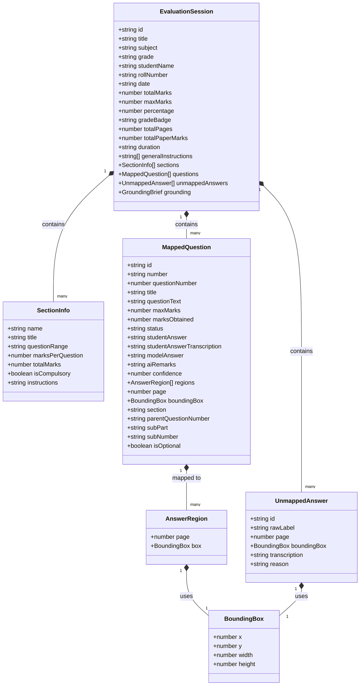
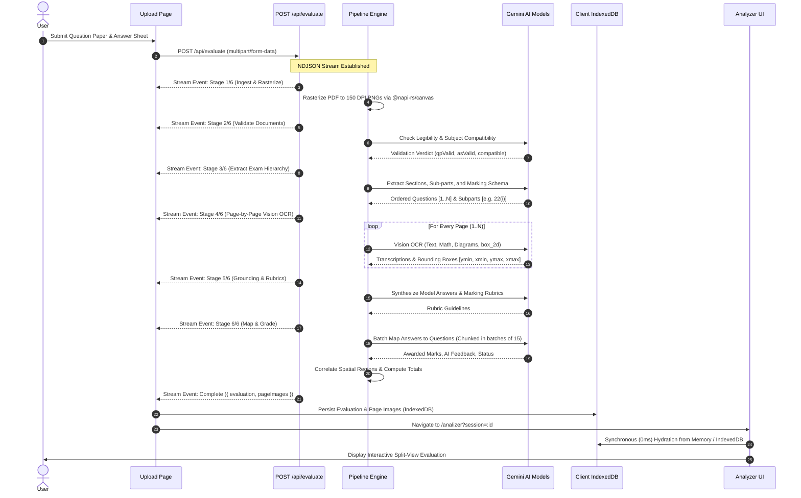
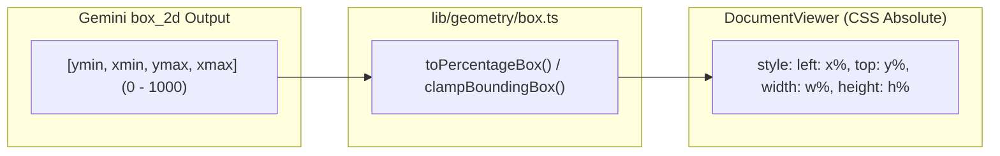

# Veda AI — Intelligent Handwritten Exam Evaluation Engine

Veda AI is an automated exam evaluation engine engineered to assess student handwritten answer sheets against printed exam question papers. The platform ingests heterogeneous PDF/image documents, extracts hierarchical printed exam structures (sections, questions, sub-parts, and mark schemes), transcribes handwritten responses along with diagrams and mathematical notations, semantically maps student answers to question numbers, and grades submissions while generating verifiable spatial bounding boxes over rasterized answer sheets.

---

## 1. High-Level Design (HLD)

### 1.1 Architecture Overview

```mermaid
graph TD
    subgraph ClientLayer ["Client Layer (Next.js 16 / React 19)"]
        UploadUI["Upload Page (upload-page.tsx)"]
        AnalyzerUI["Analyzer Page (analyzer-page.tsx)"]
        DocViewer["Document Viewer (document-viewer.tsx)"]
        QCard["Question Card (question-card.tsx)"]
        ClientCache["Client Cache (IndexedDB / Memory / sessionStorage)"]
    end

    subgraph APILayer ["API Routing & Ingestion (Next.js App Router)"]
        EvaluateAPI["POST /api/evaluate (NDJSON Stream)"]
        StatusAPI["GET /api/sessions/:id/status"]
        SessionAPI["GET /api/sessions/:id"]
        PagesAPI["GET /api/sessions/:id/pages/:page"]
    end

    subgraph PipelineLayer ["AI Evaluation Pipeline (lib/ai/pipeline.ts)"]
        Rasterizer["PDF Rasterizer (@napi-rs/canvas + pdf-to-img)"]
        DocValidator["Document Validator (Gemini 2.5/3.5 Flash)"]
        QExtractor["Question & Section Extractor (Gemini)"]
        AnswerExtractor["Page-by-Page Vision OCR & Diagrams (Gemini)"]
        GroundingLoop["Grounding & Rubric Synthesis (thinking-loop.ts)"]
        GradingEngine["Batch Mapping & Grading Engine (Gemini)"]
        SpatialCorrelator["Spatial Box Normalizer (box.ts)"]
    end

    subgraph StateStorage ["Storage & Memory Engines"]
        GlobalStore["Global Process Store (globalThis.vedaSessions)"]
        TmpMirror["Filesystem Mirror (/tmp/vedaSessions.json)"]
        IndexedDBStore["Client IndexedDB (veda_ai_db)"]
    end

    subgraph AIProvider ["Google GenAI Provider"]
        GeminiPool["Gemini API Key Pool (Automatic 401/429 Failover)"]
        GoogleSearch["Google Search Tool (Optional Grounding)"]
    end

    UploadUI -->|Multipart Upload| EvaluateAPI
    EvaluateAPI -->|NDJSON Stream Events| UploadUI
    UploadUI -->|Persist Heavy Payload & Images| ClientCache
    ClientCache -->|Store Base64 Images| IndexedDBStore
    AnalyzerUI -->|Instant 0ms Hydration| ClientCache
    DocViewer -->|Render Data URLs / Fetch| PagesAPI

    EvaluateAPI --> Rasterizer
    Rasterizer -->|Store PNG Buffers| GlobalStore
    GlobalStore -->|Disk Mirror| TmpMirror

    EvaluateAPI --> PipelineLayer
    DocValidator --> GeminiPool
    QExtractor --> GeminiPool
    AnswerExtractor --> GeminiPool
    GroundingLoop --> GeminiPool
    GroundingLoop -.-> GoogleSearch
    GradingEngine --> GeminiPool
    GradingEngine --> SpatialCorrelator

    PipelineLayer --> GlobalStore
    GlobalStore --> SessionAPI
    GlobalStore --> StatusAPI
    GlobalStore --> PagesAPI
```



---

## 2. Low-Level Design (LLD)

### 2.1 Domain Data Models



---

## 3. AI Evaluation Pipeline Architecture



---

## 4. Pipeline Execution Stages

### Stage 1: Ingest and Rasterize
- Accepts Question Papers and Answer Sheets in PDF or image format (`.pdf`, `.png`, `.jpg`, `.jpeg`).
- Rasterizes multi-page answer PDFs into high-resolution 150 DPI PNG buffers using `pdf-to-img` powered by native `@napi-rs/canvas` bindings and polyfilled `DOMMatrix`, `DOMPoint`, `DOMRect`, `ImageData`, and `Path2D`.
- Pre-loads `pdfjs-dist/legacy/build/pdf.worker.mjs` to ensure deterministic execution in serverless runtimes.

### Stage 2: Multimodal Document Validation
- Validates that the uploaded question paper is a genuine test/exam document and the answer sheet contains student handwritten responses.
- Evaluates scan quality, legibility, and cross-document subject alignment.
- Emits structured `SessionFailure` with actionable recovery suggestions if unreadable.

### Stage 3: Question and Section Extraction
- Preserves complete printed exam hierarchy:
  - Total paper marks, duration, and general instructions.
  - Section definitions (`Section A`, `Section B`, `Part I`, `Part II`, etc.).
  - Preserves sub-part labels such as `11(a)`, `22(i)`, `33(v)`.
  - Captures compulsory vs optional question rules and per-question mark allocations.

### Stage 4: Page-by-Page Spatial Vision OCR and Diagram Detection
- Processes each rasterized page sequentially through Gemini's multimodal vision model.
- Transcribes handwriting, printed headings, mathematical equations, and notes.
- Identifies hand-drawn diagrams, line graphs, bar charts, and circuit sketches.
- Generates exact normalized coordinates `box_2d: [ymin, xmin, ymax, xmax]` normalized from `0` to `1000`.

### Stage 5: Grounding and Rubric Synthesis
- Synthesizes expected answers, solution criteria, and partial-marking rubrics.
- Grounding notes are provided to the grading engine to ensure consistency across batches.

### Stage 6: Batch Mapping, Grading, and Spatial Correlation
- Processes questions in chunks of 15 to ensure reliable JSON parsing within token budget limits.
- Matches out-of-order student answers using visible question labels and semantic content.
- Assigns evaluation status: `correct`, `partial`, `incorrect`, or `unanswered`.
- Awards marks strictly bounded by `0` to `maxMarks`.
- Identifies orphan or unmapped answers as `unmappedAnswers`.
- Computes aggregate metrics: total marks, percentage, and letter grade classifications.

---

## 5. Spatial Coordinate System and CSS Overlays

Gemini outputs 2D spatial coordinates in normalized `[ymin, xmin, ymax, xmax]` integer format spanning `[0, 1000]`.

`lib/geometry/box.ts` transforms normalized coordinates to CSS percentage geometry:

$$\text{x} = \frac{\text{xmin}}{10} \%$$
$$\text{y} = \frac{\text{ymin}}{10} \%$$
$$\text{width} = \frac{\text{xmax} - \text{xmin}}{10} \%$$
$$\text{height} = \frac{\text{ymax} - \text{ymin}}{10} \%$$



---

## 6. Resilience and Fault Tolerance

1. **NDJSON Stream Over Active HTTP:**
   - Long-running evaluations stream progress over an open HTTP response (`POST /api/evaluate`), avoiding serverless cross-instance state synchronization issues.
2. **Multi-Tier Client Storage:**
   - **IndexedDB (`veda_ai_db`):** Stores multi-megabyte base64 page images and full evaluation trees without browser `sessionStorage` 5MB quota errors.
   - **In-Memory Cache:** Provides 0ms instant hydration during client-side navigation.
   - **Safe `sessionStorage`:** Stores lightweight session metadata for page refresh resilience.
3. **Dynamic API Key and Model Failover:**
   - Automatically rotates keys from `GEMINI_API_KEYS` on `429 RESOURCE_EXHAUSTED`.
   - Automatically blacklists invalid keys on `401 UNAUTHENTICATED` without crashing.
   - Automatically switches model tiers on `404` or transient `503` events.
4. **Resilient JSON Parser:**
   - Employs `jsonrepair` and regex-based truncation closure to recover malformed or cut-off model responses.

---

## 7. Tech Stack

| Domain | Technology |
|---|---|
| **Framework** | Next.js 16 (App Router, Turbopack), React 19, TypeScript |
| **Styling** | Tailwind CSS v4, Lucide Icons, Bricolage Grotesque Font |
| **Client State** | TanStack Query v5, Native IndexedDB API, Axios |
| **AI Runtime** | `@google/genai` (Gemini 2.5/3.5 Flash & Lite Pool) |
| **Document Processing** | `pdf-to-img`, `@napi-rs/canvas`, `poppler-utils` (`pdftoppm`) |
| **Resilience & Parsing** | `jsonrepair`, Custom NDJSON Stream Reader |
| **Runtime & Tooling** | Node.js / Bun |

---

## 8. Directory Structure

```text
veda-ai/
├── app/
│   ├── analizer/
│   │   └── page.tsx                 # Analysis and document inspection route
│   ├── api/
│   │   ├── evaluate/
│   │   │   └── route.ts             # NDJSON evaluation streaming endpoint
│   │   └── sessions/
│   │       └── [id]/
│   │           ├── route.ts         # Session evaluation query endpoint
│   │           ├── pages/[page]/    # Rasterized PNG page server
│   │           └── status/route.ts  # Polling fallback endpoint
│   ├── layout.tsx                   # Root layout and query providers
│   └── page.tsx                     # Ingestion and upload landing page
├── components/
│   ├── page/
│   │   ├── analyzer-page.tsx        # Split-screen evaluation inspector
│   │   ├── document-viewer.tsx      # Raster viewer with CSS bounding box overlays
│   │   ├── question-card.tsx        # Question score, rubric, and feedback card
│   │   ├── sidebar-nav.tsx          # Collapsible navigation drawer
│   │   ├── upload-page.tsx          # Two-file picker, progress bar, stream reader
│   │   └── mock-data.ts             # Demo mode sample dataset
│   └── providers/
│       └── query-provider.tsx       # TanStack Query client configuration
├── lib/
│   ├── ai/
│   │   ├── gemini.ts                # GenAI client, key pool, retry and failover
│   │   ├── pipeline.ts              # 6-stage evaluation pipeline orchestrator
│   │   ├── prompts.ts               # Structured vision and evaluation prompts
│   │   ├── schemas.ts               # Zod validation schemas for AI outputs
│   │   └── thinking-loop.ts         # Grounding and rubric synthesis
│   ├── geometry/
│   │   └── box.ts                   # Normalized box_2d to CSS percentage transformer
│   ├── pdf/
│   │   └── rasterize.ts             # Serverless-safe PDF to PNG rasterizer
│   ├── session/
│   │   ├── client-cache.ts          # IndexedDB and memory client storage
│   │   └── store.ts                 # Global process session store & disk mirror
│   └── types/
│       └── evaluation.ts            # Canonical TypeScript interfaces
├── public/
│   └── sample/                      # Bundled sample question and answer PDFs
├── scripts/
│   └── test-sample.ts               # Automated end-to-end CLI evaluation runner
├── next.config.ts                   # Serverless external package configurations
└── package.json                     # Project dependencies and build scripts
```

---

## 9. Getting Started

### Prerequisites
- Node.js 20+ or [Bun](https://bun.sh)
- A valid Google Gemini API Key ([Google AI Studio](https://aistudio.google.com/))

### Installation

```bash
git clone https://github.com/Basharkhan7776/vedaAi.git
cd veda-ai
bun install
```

### Environment Configuration

Create a `.env.local` file in the root directory:

```env
# Primary Google AI Studio Key
GEMINI_API_KEY=your_primary_gemini_api_key_here

# Optional: Comma-separated backup keys for automatic failover
GEMINI_API_KEYS=key1,key2,key3

# Model preference (Defaults to gemini-3.5-flash)
GEMINI_MODEL=gemini-3.5-flash

# Optional features
ENABLE_GOOGLE_SEARCH=false
SKIP_THINKING_LOOP=false
```

### Development Server

```bash
bun dev
```
Open [http://localhost:3000](http://localhost:3000) in your browser.

### Production Build

```bash
bun run build
bun start
```

### Automated Pipeline Test

Run the end-to-end evaluation pipeline against the bundled sample exam:

```bash
bun run scripts/test-sample.ts
```
